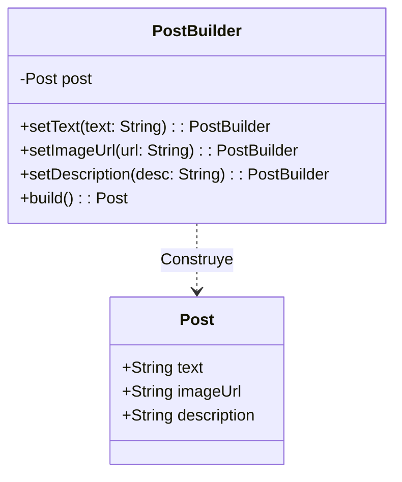

Refactorización: Integración de Moderación Legada usando el Patrón Adapter

Problemas Identificados

Durante la revisión del código del repositorio, se identificaron los siguientes problemas de diseño y arquitectura relacionados con el servicio de moderación de publicaciones (`legacy-moderation.client.ts`):

1. Interfaz Inconsistente (Código Legado):
   El cliente de moderación existente retornaba múltiples tipos de datos de forma inconsistente (`string`, `number`, `object`), dependiendo de la regla de negocio que se activara. Por ejemplo:
    - Retornaba `"BLOCK"` si encontraba palabras prohibidas.
    - Retornaba `{ pass: true, reason: "legacy-rule-3" }` para ciertas validaciones.
    - Retornaba `1` u `"OK"` en otros casos.

2. Alto Acoplamiento en la Lógica de Negocio:
   Si se usaba el cliente legado directamente, el servicio principal (`PostsService`) iba a estar fuertemente acoplado a las particularidades de esta API antigua, obligando a manejar toda la lógica condicional de tipos mixtos en el flujo principal de creación de publicaciones.

3. Falta de Abstracción:
   No existía un contrato claro sobre lo que el sistema esperaba de un "Moderador de Contenido", dificultando la posibilidad de cambiar de proveedor en el futuro o realizar pruebas unitarias (Testing) a través de mocks.

4. Inconsistencia en los DTOs:
   Se estaba intentando enviar a moderación un campo genérico `content` que no existía en `CreatePostDto`, el cual realmente estructuraba la información en `title` y `description`.

Solución Aplicada

Para aislar el problema y estandarizar la comunicación en nuestro sistema, implementamos el **Patrón Estructural Adapter (Adaptador)**.

1. Definición de la Interfaz Objetivo (Target)
   Creamos la interfaz `ContentModerator` (`src/posts/moderation.interface.ts`) que define un contrato limpio y estandarizado. Ahora, cualquier sistema de moderación debe simplemente recibir un texto y devolver un `Promise<boolean>`.

2. Creación del Adaptador (Adapter)
   Desarrollamos la clase `LegacyModerationAdapter` que implementa la interfaz `ContentModerator`. Su única responsabilidad es:

- Llamar a la API legada subyacente (`legacyModerationApi.review`).
- "Traducir" o normalizar todas las respuestas inconsistentes (`"BLOCK"`, `"OK"`, `1`, `{ pass: true }`) a un simple valor booleano (`true` para contenido seguro, `false` para contenido bloqueado).

3. Inyección de Dependencias (Dependency Inversion)
   Refactorizamos `PostsService` para que dependa únicamente de la abstracción (`CONTENT_MODERATOR_TOKEN`), ignorando por completo la implementación del cliente legado. Configuramos el módulo de NestJS (`PostsModule`) para inyectar nuestro Adapter cuando se requiera dicho token.

4. Corrección del Flujo de Datos
   Actualizamos el servicio para que lea correctamente los campos validados por class-validator (`dto.title` y `dto.description`) y aplique la moderación a los textos correctos.

🧪 Implementación y validación del sistema (trabajo realizado)

Durante esta etapa del proyecto se trabajó en la implementación, corrección y validación del backend del sistema de feed social. El desarrollo se enfocó en asegurar el correcto funcionamiento de las principales funcionalidades del sistema y en verificar la lógica de negocio mediante pruebas reales.

🔧 Funcionalidades implementadas y verificadas

Se completó y validó el funcionamiento de los siguientes módulos:

Creación de publicaciones mediante POST /api/posts
Sistema de likes con peso asociado mediante POST /api/posts/:id/likes
Obtención del feed de publicaciones mediante GET /api/posts/feed
Cálculo dinámico de métricas del sistema:
Cantidad total de likes (likesCount)
Cantidad de comentarios (commentsCount)
Score de relevancia (relevanceScore)
Generación de metadata asociada a cada publicación
⚙️ Ordenamiento del feed

Se validó el comportamiento del feed según distintos modos de ordenamiento:

latest: ordenado por fecha de creación
mostLiked: ordenado por cantidad de likes
mostCommented: ordenado por cantidad de comentarios
relevance: ordenado por score de relevancia calculado

Este comportamiento implementa de forma implícita un patrón de diseño tipo Strategy, donde el criterio de ordenamiento cambia dinámicamente según el parámetro mode.

🧪 Pruebas realizadas

Las pruebas se realizaron utilizando herramientas como cURL y Swagger, validando:

Creación correcta de publicaciones
Persistencia de datos en la base de datos SQLite
Funcionamiento del sistema de likes y su impacto en el feed
Cambios dinámicos en el orden del feed según el modo seleccionado
📊 Resultado obtenido

El sistema responde correctamente a todas las operaciones implementadas, reflejando los cambios en tiempo real dentro del feed y validando la coherencia de la lógica de negocio.

🧠 Conclusión técnica

El sistema implementa una lógica de comportamiento dinámico equivalente al patrón Strategy, aplicado en el ordenamiento del feed. Esto permite modificar el comportamiento del sistema sin alterar su estructura principal, facilitando su escalabilidad.

### 1. Patrón Creacional: Builder (Creación de Publicaciones)

**Problema identificado:**
Al analizar la lógica de negocio para la creación de publicaciones (_posts_), notamos que la instanciación podía volverse propensa a errores y difícil de leer. Dado que una publicación puede tener atributos opcionales (por ejemplo, puede tener solo texto, texto e imagen, o texto, imagen y descripción), el uso de un constructor tradicional nos obligaría a pasar valores `null` o `undefined`, generando un código rígido y difícil de escalar si en el futuro se agregan nuevos atributos.

**Solución aplicada:**
Para solucionar esto, implementamos el patrón creacional **Builder**. Encapsulamos la lógica de creación dentro de una clase `PostBuilder`, lo que nos permite construir el objeto paso a paso. De esta forma, el servicio ya no necesita conocer los detalles de instanciación del objeto, y el código resultante es mucho más declarativo, limpio y fácil de mantener.

**Diagrama de Clases:**

# Feed de Publicaciones

Este proyecto implementa un feed social sencillo, sin usuarios ni autenticación, centrado en la interacción entre publicaciones, likes y comentarios. La aplicación está pensada para simular una plataforma de contenido visual con lógica de negocio realista pero acotada.

## Requerimientos

- Docker

## Resumen funcional

El sistema permite crear publicaciones con imagen, texto y descripción, y mostrarlas en un feed central. Cada publicación puede recibir likes y comentarios, y esas interacciones modifican cómo se percibe su importancia dentro del feed.

El comportamiento general del producto gira alrededor de tres ideas:

- **contenido**: las publicaciones son la unidad principal del sistema,
- **interacción**: likes y comentarios enriquecen cada publicación,
- **priorización**: el feed puede cambiar de orden según distintos criterios de relevancia.

## Lógica de negocio principal

La lógica del sistema no solo guarda datos, también construye una vista enriquecida del feed. Para cada publicación se calcula información derivada, como la cantidad de interacciones y una puntuación de relevancia que combina actividad reciente con volumen de participación.

Además, antes de persistir comentarios se aplica una validación/moderación para filtrar contenido problemático. El sistema también ejecuta efectos operativos cuando se crean interacciones (por ejemplo trazas y procesos internos de recálculo), reflejando un flujo típico de aplicaciones de contenido.

## Contexto técnico

La solución está construida con NestJS en backend, Prisma ORM y SQLite como almacenamiento local.

La base de datos es fija en `sqlite.db`

## Ejecución:

Para levantar todo el sistema con Docker:

1. `make setup`
2. `make run`

Este comando construye la imagen, instala dependencias dentro del contenedor, aplica migraciones Prisma, genera el cliente y arranca NestJS en modo watch.

En este flujo, los artefactos de compilación y cache de paquetes se mantienen dentro de volúmenes Docker para no ensuciar el directorio del proyecto.

La aplicación queda disponible en:

- `http://localhost:3000`
- `http://localhost:3000/docs`
- `http://localhost:5555` (Prisma Studio - Database Manager)

Comandos útiles:

- `make stop` para detener el contenedor
- `make logs` para ver logs en tiempo real
